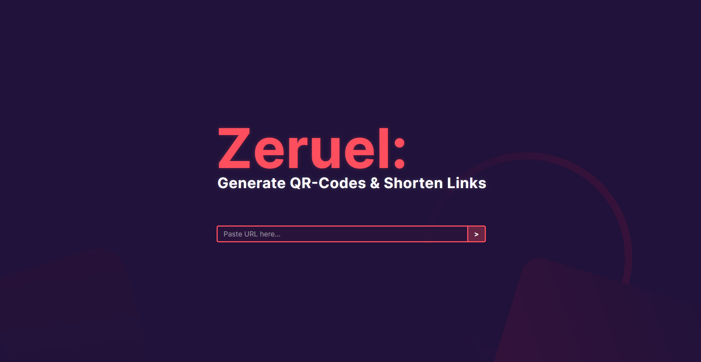
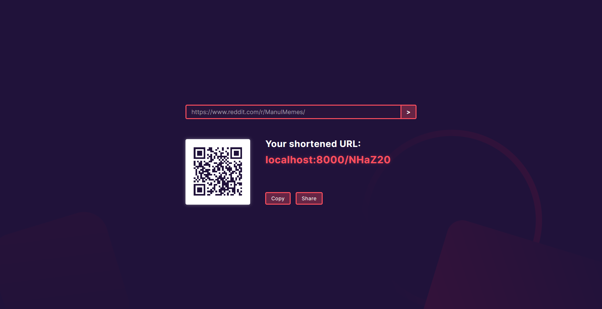

<h3 align="center"> Zeruel: Generate QR-Codes & Shorten Links</h3>

Built with Rust & SQLite, Zeruel is a lightweight & easy to use QR-Code generator and URL shortner.

  
  

  
## Installation Guide
### Note: Zeruel is currently in development.

0. Install <a href="https://www.rust-lang.org/learn/get-started" rel="noreferrer noopener">Rust</a> & <a href="https://www.sqlite.org/download.html" rel="noreferrer noopener">SQLite</a>'s "Precompiled Binaries".
   - For more information on installing SQLite, I recommend [this guide]().
2. `git clone https://github.com/wiki-Bird/Zeruel`
3. `cd Zeruel`
4. `cargo build`
5. `cd Zeruel/rust_qr`
6. `diesel migration run`
7. `cargo run`
8. Open `http://localhost:8000` in your browser.

  
## Images

  
## Core Dependencies
<ul>
  <li><a href="https://www.rust-lang.org" rel="noreferrer noopener">Rust</a> 1.73.0
  </li>
  <li><a href="https://www.sqlite.org/download.html" rel="noreferrer noopener">SQLite </a>3.42.0</li>
</ul> 
